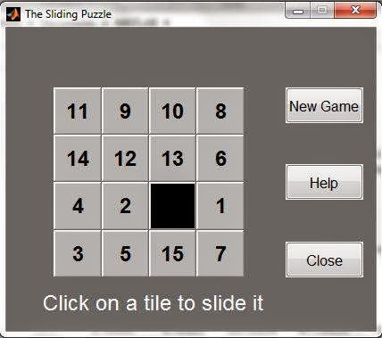
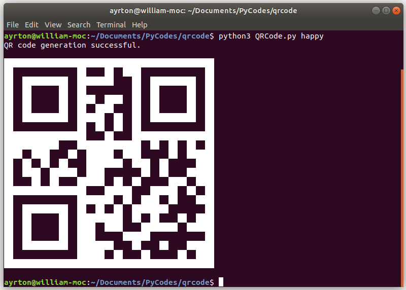

# Miscellaneous
A repository containing a variety of interesting things, which can have been written in any language.

# About this project

This repo contains the following items:

- **C++:**
  - Operator Overload: A nice way to implement your usage of any basic operator such as +, -, *, /, [], = and more. Only need to implement methods called operator<op> inside the classes you created. For instance, method "operator+" redefines what the usage of "+" can do for the class created.

- **MatLab:**
  - Command Window Easter Eggs: For example, if you type "fifteen" in the command line, then this GUI shows up.

  

	
  

  
- **Python:**
  - Generation of QR Codes:
  

	
  

# Getting Started

Instalation of compilers, interpreters and dependencies needed to run the codes in this repo.

**Python**

	$ pip3 install pyqrcode
	
**C++**
	
	$ sudo apt install g++

# References

1. Matlab Easter Eggs. Ashan's Blog. Engineering, electronics and coding ... Available at: [http://ashanpeiris.blogspot.com/2014/12/matlab-easter-eggs.html](http://ashanpeiris.blogspot.com/2014/12/matlab-easter-eggs.html). Access at February, 2020.
